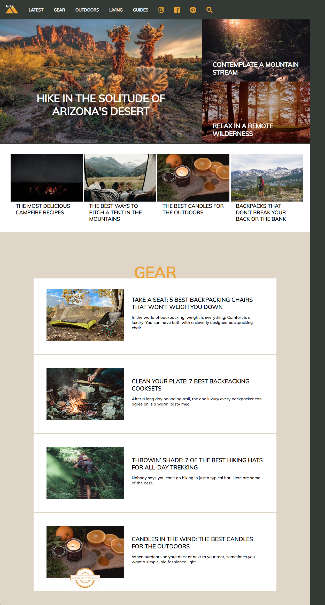

### CodeSquad Group Project - Hike! Homepage

A fictional company called "Hike!" has come to you to ask you to build their new homepage for their site that provides information to avid hikers.  A design firm has created the mockup for the page and Hike! needs you to make it into a real html page that looks exactly like the mockup.

This is an opportunity to use the HTML and CSS skills you've learned so far plus a few more tricks you'll learn as we do the project to make a professional-looking webpage.  You will build it in stages until the whole page is complete.

Below is how the page will look:

